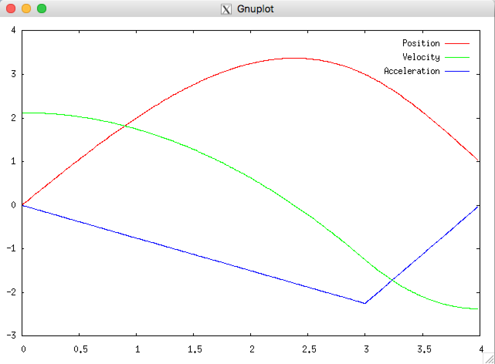
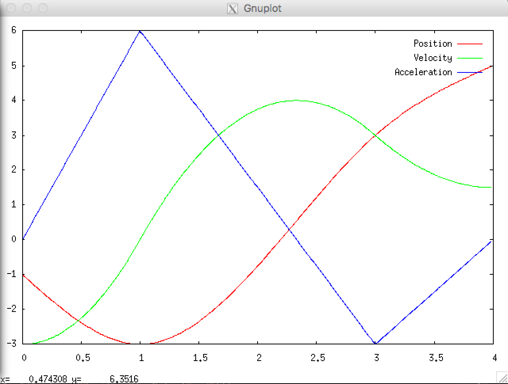

# trajectory

Trajectory interpolator for Rust.

## Code example

```rust
let times = vec![0.0, 1.0, 3.0, 4.0];
let points = vec![
    vec![0.0, -1.0],
    vec![2.0, -3.0],
    vec![3.0, 3.0],
    vec![1.0, 5.0],
];
let ip = CubicSpline::new(times, points).unwrap();
for i in 0..400 {
    let t = i as f64 * 0.01f64;
    let p = ip.position(t).unwrap();
    let v = ip.velocity(t).unwrap();
    let a = ip.acceleration(t).unwrap();
}
```

## Run example

It requires `gnuplot`.

```bash
cargo run --example plot
```


